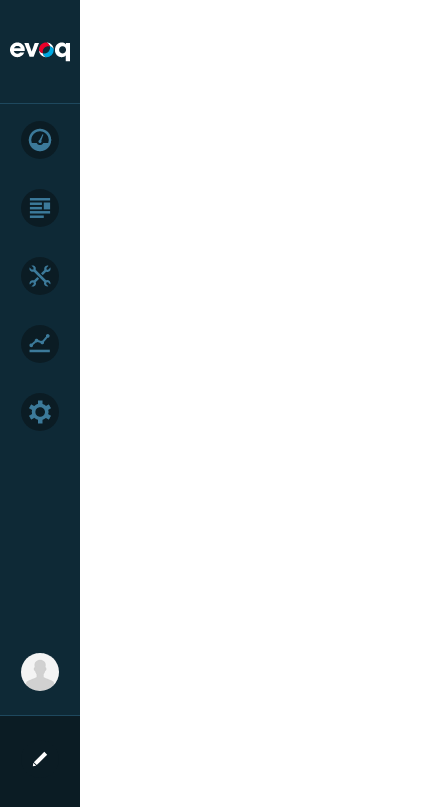
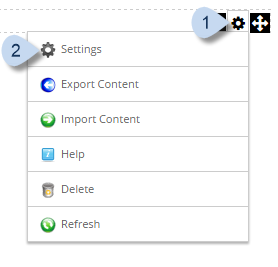
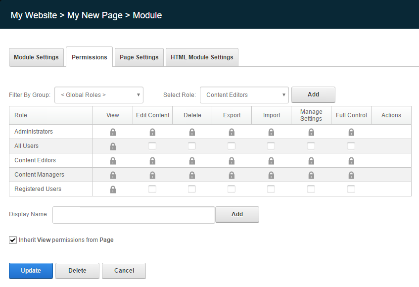
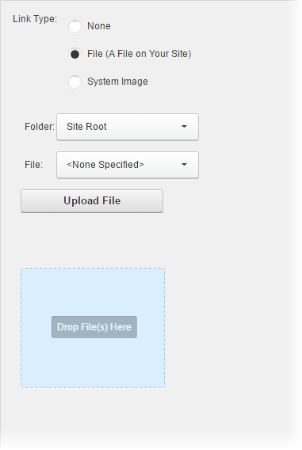
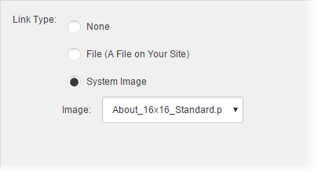

# Configure a Module on a Page via the Persona Bar

## Steps

1.  Go to the page containing the module to configure.
2.  Go to Persona Bar \> Edit.
    
    
    
3.  In the module's action menu bar, go to Manage (gear icon) \> Settings.
    
      
    
    
    
      
    
4.  In the Module Settings tab, configure the settings of the module instance.
    
      
    
    
    
      
    
    Note: Changes to these settings will affect the display of the module instance wherever it is referenced.
    
     
    
    Module Settings — Basic Settings
    
    Module Culture
    
    If the module is available for different cultures (language-region), choose which one to use for this module instance. The default is Neutral Culture.
    
    Module Title
    
    Appears in the container's title bar, if the container supports it.
    
    Tags
    
    Comma-separated tags to associate with the article.
    
     
    
    Module Settings — Advanced Settings
    
    Display Module on All Pages
    
    Administrators: If checked, the module appears in the same position on all pages in the site.
    
    Is Shareable
    
    If checked, the module can be shared across sites.
    
    View Only
    
    If checked, the module is shared across sites as viewable only.
    
    Hide Admin Border
    
    By default, a border appears around the module if the user is an administrator to indicate that this module is visible only to administrators. If checked, the border is not displayed.
    
    Header  
                                   Footer
    
    Enter text that you want to display before (header) and after (footer) the module content.
    
    Start Date  
                                   End Date
    
    Click/Tap on the calendar icon to choose the date (server date); the default is the current date. Click/Tap on the clock icon to choose the time; the default is 12:00 AM (server time).
    
    *   The module is published after the specified start date. If Start Date is not set, the module is published immediately.
    *   The module is hidden after the specified end date. If End Date is not set, the module is visible indefinitely.
    
    Module Moniker
    
    An identifier for the module. The identifier must be unique within the page.
    
5.  (Optional) In the Permissions tab, configure which roles can do which actions on this module.
    
      
    
    
    
      
    
    1.  (Optional) To filter the displayed roles, select the role group from the Filter By Group dropdown.
    2.  (Optional) To add another role to the list, choose the additional role from the Select Role dropdown, and click/tap Add.
    3.  (Optional) To add a specific user to the list, enter part of their display name, select the correct user from the list, and click/tap Add.
    4.  (Optional) Check the appropriate checkboxes to enable each role to perform actions on the module.
    5.  (Optional) To specify view permissions that are different from the parent page, uncheck Inherit View permissions from Page.
6.  In the Page Settings tab, configure the page-related settings of the module instance.
    
      
    
    
    
      
    
    Note: Changes to Page Settings will affect only the page where the module instance is.
    
     
    
    Page Settings — Basic Settings
    
    Icon
    
    The icon to be displayed in the module's title bar.
    
    *   Choose None if you do not need an icon for the module.
    *   Choose File to provide your own file.
        
          
        
        
        
          
        
        To choose a file that is already on your site,
        
        1.  Select File (A File on Your Site).
        2.  Choose the Folder where the file can be found.
        3.  Choose the File.
        
        To upload a file,
        
        1.  Select File (A File on Your Site).
        2.  Choose the Folder where the uploaded file should go.
        3.  Drag and drop the files from your local storage to the Drop File(s) Here area.
        
        Alternately, you can copy a file from a URL to your site.
        
        1.  Select File (A File on Your Site).
        2.  Click/Tap Upload File.
        3.  In the Upload Files dialog,
            
            1.  click/tap From URL,
            2.  choose the target location on your site,
            3.  enter the source URL, and
            4.  click/tap Upload.
            
              
            
            
            
              
            
        
    *   To choose an image that shipped with DNN,
        
        1.  Select System Image.
        2.  Choose the image from the Image dropdown.
        
          
        
        
        
          
        
    
    Alignment
    
    The default alignment of the module content. Choose Not Specified to use the setting in the container or theme.
    
    Color
    
    The color name or hexadecimal RGB value for the background of the module. Leave blank to use the setting in the container or theme. [See Wikipedia article on Web Colors.](https://en.wikipedia.org/wiki/Web_colors)
    
    Border
    
    The width (in pixels) of the border around the module. Leave blank to use the setting in the container or theme.
    
    Collapse/Expand
    
    The default visibility of the module.
    
    *   Maximized. The module is expanded.
    *   Minimized. The module is collapsed.
    *   None. Uses the setting in the container or theme.
    
    Display Container
    
    If checked, displays the container of the module.
    
    Allow Print
    
    If checked, the contents of the module can be printed.
    
    Allow Syndicate
    
    If checked, RSS is enabled on the module.
    
    Is a WebSlice
    
    If checked, the module is converted into a Web Slice, which is a portion of a web page that can be subscribed to for updates. Introduced in Internet Explorer 8. [See the FAQ about Web Slices at Microsoft.com.](http://windows.microsoft.com/en-us/windows/web-slices-faq#1TC=windows-7)
    
    Web Slice Title
    
    A name for the Web Slice.
    
    Web Slice Expires
    
    If blank, the Web Slice expires at the same time as the module.
    
    Web Slice TTL
    
    Time to live (TTL), in minutes. If blank, this value is the same as the module's time in cache (in minutes).
    
    Module Container
    
    The container to use when the module is displayed.
    
     
    
    Cache Settings
    
    Output Cache Provider
    
    The cache provider to use for this module.
    
    *   Database saves cached items to the database.
    *   File saves cached items to a file system. Ideal for a shared hosting environment.
    *   Memory saves cached items in memory. This is the fastest caching method. Ideal if the website has a large amount of RAM. Not suitable in a shared hosting environment.
    
    Cache Duration (seconds)
    
    The number of seconds that the module results would be stored in cache. Must be an integer.
    
     
    
    Page Settings — Advanced Settings
    
    Set as Default Settings
    
    (Administrators only) If checked, the settings for this module are used as the default for future modules.
    
    Apply to All Modules
    
    (Administrators only) If checked, the settings for this module are copied to all existing modules.
    
    Move To Page
    
    The target web page where the module would be moved to.
    
7.  Configure the module's custom settings, if any.
    
    Custom settings would be in an additional tab with a name that includes the module's name.