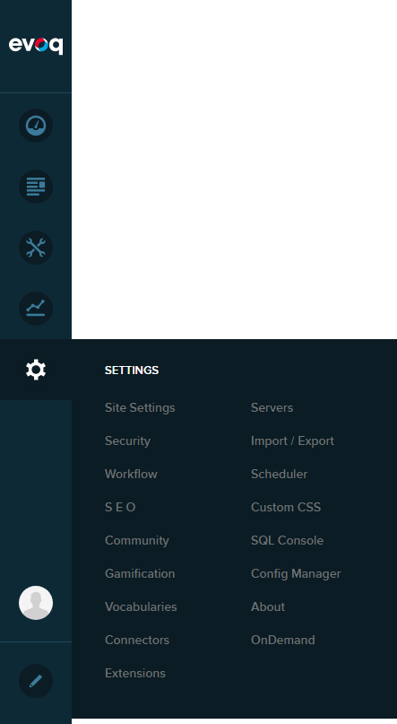
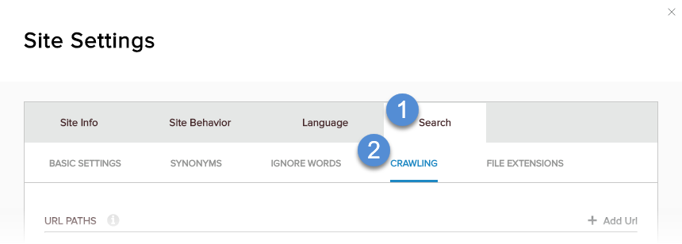
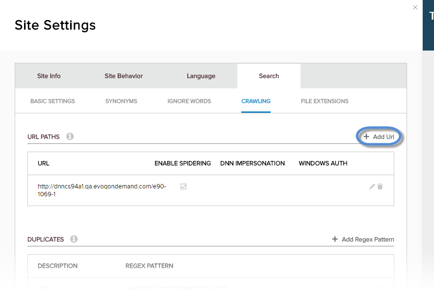
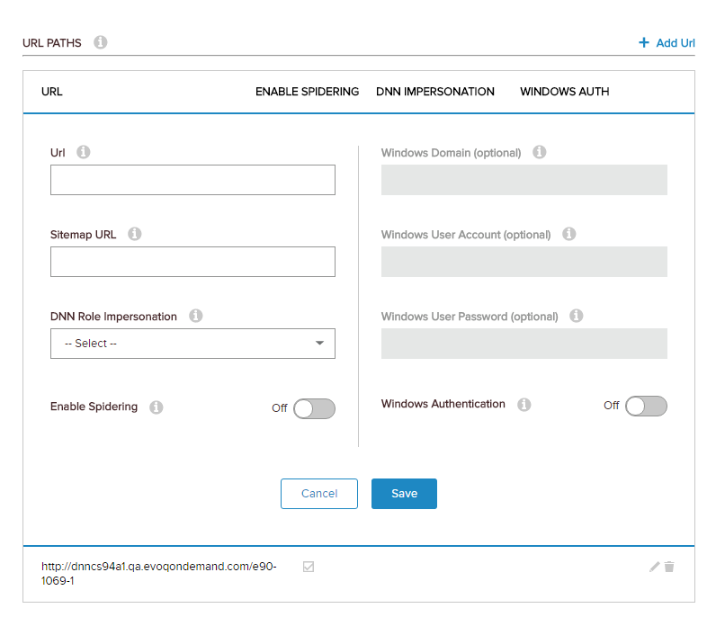

# Add a Starting URL to Crawl List

## Prerequisites

*   **An administrator account for the site.** Administrators have full permissions to the specific site.

## Steps

1.  Go to Persona Bar \> Settings \> Site Settings.
    
    
    
    ➊
    
    ➋
    
2.  Go to the Search tab, and then the Crawling subtab.
    
    
    
3.  In URL Paths, click/tap \+ Add URL.
    
      
    
    
    
      
    
4.  Configure the URL to crawl.
    
      
    
    
    
      
    
    Field
    
    Description
    
    URL
    
    The URL where crawling should start.
    
    Sitemap URL
    
    The URL of the sitemap to use, if any.
    
    DNN Role Impersonation
    
    The role assigned to the crawler to gain access to this URL path.
    
    Note: The role must have at least one user assigned to it.
    
    Enable Spidering
    
    If enabled, the specified URL is marked to be included in the next crawl. If disabled, the specified URL is not included in the next crawl; however, any existing index for this URL is still used for search.
    
    Windows Authentication
    
    If enabled, the crawler users the specified credentials to gain access to the site:
    
    *   Windows Domain
    *   Windows User Account
    *   Windows User Password
    
    If the user account and password are blank, the local server's default Windows credentials are used.
    
    Note: Enable this option if the site uses Integrated Windows Authentication.
    
5.  Save.