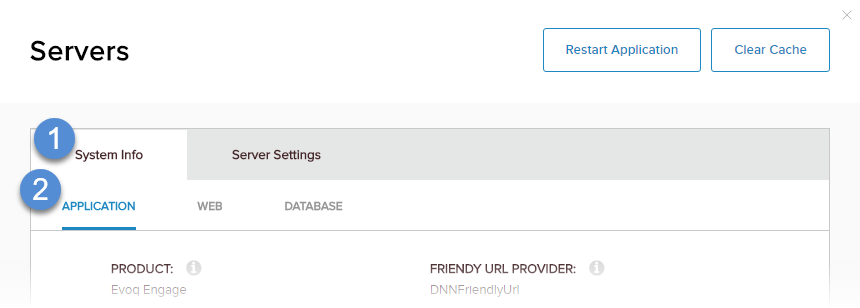
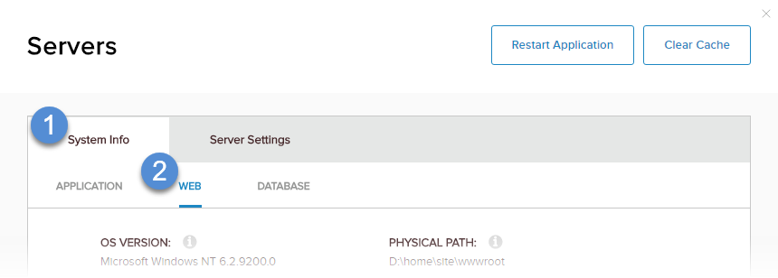
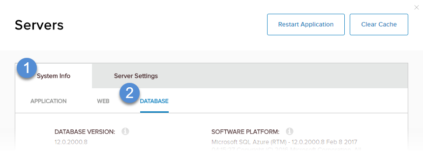

# Retrieve System Information

Note: In the DNN Platform, you can manage the web servers by using SQL commands (e.g., `select * from webservers`) through the SQL Console.

## Prerequisites

*   **A host / super user account.** Hosts have full permissions to all sites in the DNN instance.

## Steps

1.  Go to Persona Bar \> Settings \> Servers.
    
    
    
    ➊
    
    ➋
    
2.  In the System Info tab, browse the subtabs.
    *   Go to the System Info tab, and then the Application subtab.
        
        
        
        Field
        
        Description
        
        Product  
        Version
        
        Also visible from the Persona Bar logo.
        
        Host GUID
        
        Might be required by Support to identify your DNN installation.
        
        HTML Editor Provider
        
        The default HTML Editor for all sites in the installation. [Each site can specify a different HTML editor.](configure-html-editor)
        
        Data Provider
        
        SQL is the default data provider for all sites in the installation. If necessary, you can replace it by installing a custom third-party provider (not supported by DNN) and updating web.config.
        
        Caching Provider
        
        The default caching provider for all sites in the installation. [You can specify a different caching provider.](configure-caching)
        
        Logging Provider
        
        Important: Changing these settings is strongly discouraged. If necessary, you can modify them in web.config.
        
        Friendly URL Provider  
        Friendly URL Enabled  
        Friendly URL Type
        
        Important: Changing these settings is strongly discouraged. If necessary, you can modify them in web.config.
        
        Scheduler Mode
        
        *   TIMER_METHOD. A separate thread executes scheduled tasks independently.
        *   REQUEST_METHOD. Tasks are executed when HTTP requests are made.
        *   DISABLED. No scheduled tasks can be executed.
        
        Web Farm Enabled
        
        Automatically updated from the web servers table. You can view the list of servers, [enable or disable servers](enable-or-disable-web-server), or [delete the obsolete ones](delete-web-server).
        
        CAS Permissions
        
        Important: Changing these settings is strongly discouraged. If necessary, you can modify them in web.config.
        
    *   Go to the System Info tab, and then the Web subtab.
        
        
        
        Field
        
        Description
        
        OS Version  
        Web Server Version  
        .NET Framework Version
        
        Version numbers of systems installed and required by the DNN installation.
        
        ASP.NET Identity
        
        The Windows user account used with the DNN installation. This account must have sufficient permissions to access and modify folders on the server.
        
        Host Name
        
        The name of the web server used for the current host/superuser session.
        
        Physical Path
        
        The local server path to the site's root folder.
        
        Site URL
        
        The primary URL for the site.
        
        Relative Path
        
        The path to the DNN installation folder, relative to the site's root folder.
        
        Server Time
        
        The current date and time of the server.
        
    *   Go to the System Info tab, and then the Database subtab.
        
        
        
        Field
        
        Description
        
        Database Version  
        Service Pack  
        Product Edition  
        Software Platform
        
        Information about the database provider. The default database provider is SQL.
        
        Database Backup History
        
        Prior database backups. To configure database backups, use the database backup application (i.e., SQL Backup Manager).
        
        Database Files
        
        Current files used by the database.