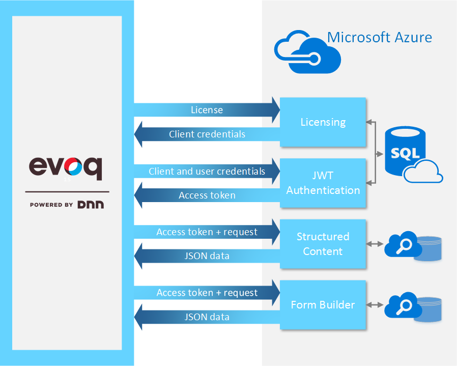

# Creating Content with Microservices

## About Microservices

Microservices provide services to apps and to other microservers through APIs and HTTP. The microservice architecture enables faster development, better scalability, and continuous deployment. In addition, it limits the effects of errors, because microservices are self-contained. Even the data storage of a microservice is independent from those of other microservices.

Evoq includes the following microservices:

Microservice

Introduced in

Description

Licensing

Evoq 8.5

(Infrastructure) Validates the client, which can be a DNN installation, a Drupal site, a Wordpress site, or a mobile app. Requires the client license, and returns the client ID and credentials, which are required by the Authentication microservice.

Authentication

Evoq 8.5

(Infrastructure) Validates a user. Requires the client site's credentials and the user's credentials. Returns JWT containing the access and renewal tokens. The access token must be included in requests to other microservices to vouch for the user's identity.

Analytics

Evoq 9.0

Provides an interface with Google Analytics to help you analyze traffic on your site.

Structured Content

Evoq 8.5

(Functional) Stores and serves content items to be displayed in a webpage or an app. Includes content items, content types, and visualizers.

Form Builder

Evoq 8.5

(Functional) Allows the creation of forms and presents those forms in a webpage or an app. Also displays responses to published forms.

Important: Microservices must be enabled by the host/superuser for a site before they can be used.

## Using Microservices

Using the built-in microservices in an Evoq website is as simple as adding a module to a page. Evoq provides default content types and forms that you can use as is or customize.

Example: To add a survey,

1.  Create the survey form and configure the fields.
2.  Create a new page or edit an existing one.
3.  In any content pane, click/tap the module icon and choose Forms.
4.  Choose the form you created.
5.  Publish the page.
6.  Review the responses to your form.