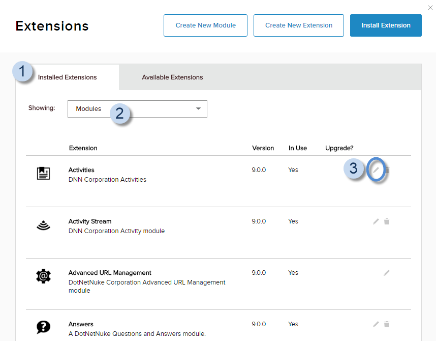
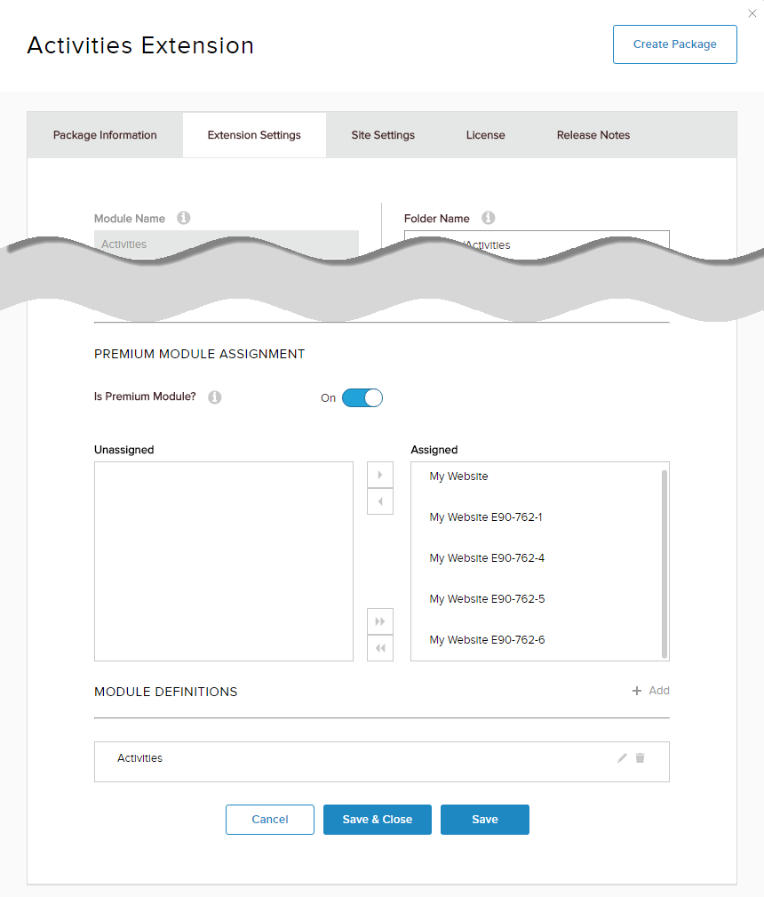

# Manage a Premium Module

If a module is set as Premium, its availability can be restricted at the site level and at the role level.

After installation, hosts can set the module to Premium and select which websites can access the module. If a module is designed to be premium by default, hosts only need to select the sites that can use it.

Then the administrators of each enabled site can assign Deploy Module permissions to a role, such as the Content Manager, to allow users in that role to add the module to a page.

## Prerequisites

**A host / super user account.** Hosts have full permissions to all sites in the DNN instance. A host account is required to upload modules and themes, because they might contain executable code. (An administrator account is sufficient to apply modules and themes to a website.)

## Steps

Installing a module requires host permissions.

1.  Go to Persona Bar \> Settings \> Extensions.
    
    
    
    ➊
    
    ➋
    
2.  Open the module for editing.
    
      
    
    
    
      
    
    1.  Go to the Installed Extensions tab.
    2.  In the Showing dropdown, choose Modules.
    3.  Click/Tap the pencil icon for the module you want.
3.  Go to the Extension Settings tab and scroll down to the Premium Module Assignment section.
4.  Set the module to premium, and select the sites that you allow to use the module.
    
      
    
    
    
      
    
    1.  Check the Is Premium Module? box.
    2.  Drag a website to the Assigned panel or to the Unassigned panel to enable or disable the module for that website.

## What to do next

[Grant Deploy Module permissions to a role, such as the Content Manager, to allow users in that role to add the module to a page.](allow-module-use)