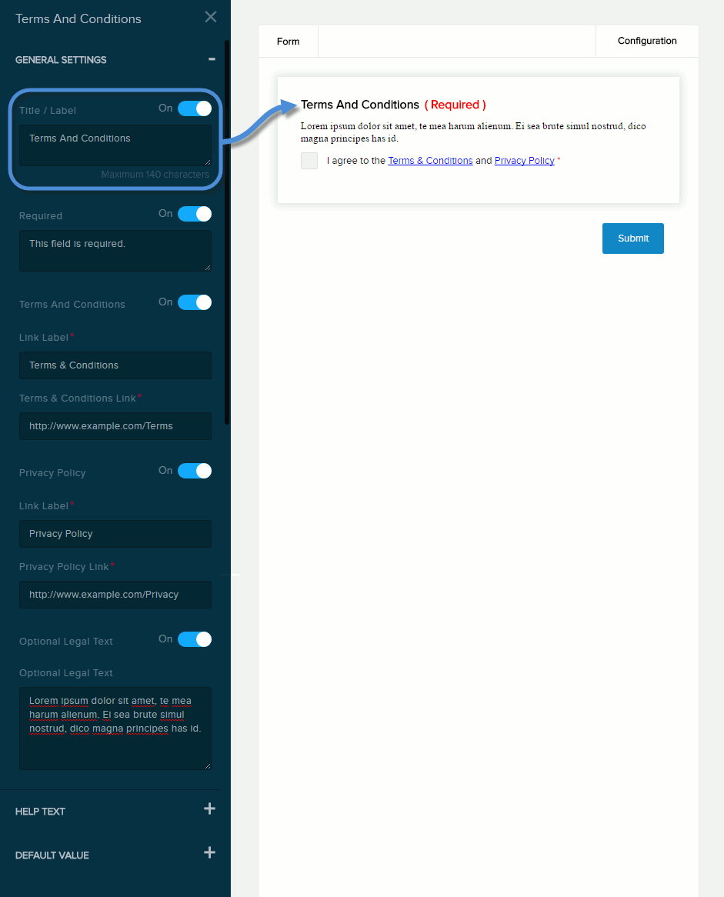
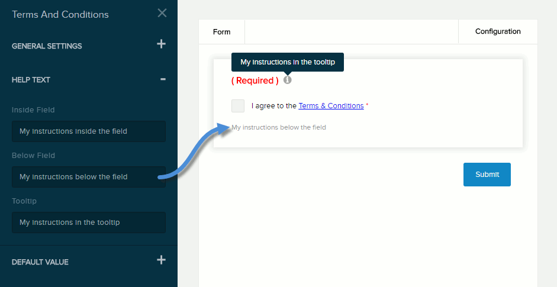
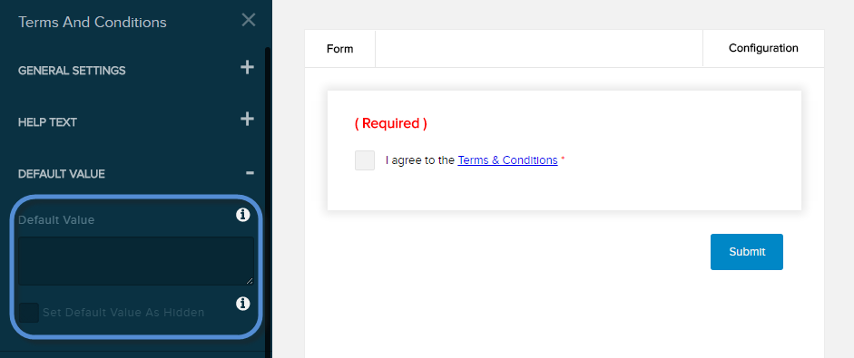

# Form Field: Terms and Conditions

## General Settings

  

  

Field

Description

Title/Label

If enabled (On), displays the title/label you specify in the text box.

Required

If enabled (On),

*   The field name is marked as required.
*   The message you enter in the provided text box will be displayed if the user does not provide a value in the field.

Terms And Conditions

If enabled (On), adds the link you specify in Terms & Conditions Link with the link text you specify in Link Label.

Privacy Policy

If enabled (On), adds the link you specify in Privacy Policy Link with the link text you specify in Link Label.

Optional Legal Text

If enabled (On), displays the legal text you enter in the provided text box.

## Help Text

  

  

Field

Description

Below Field

Help text to be displayed below the field. Maximum length: 140 characters.

Tooltip

If enabled (On) and the user hovers/clicks/taps over the information icon (i) next to the field name, displays the help text you enter in the provided text box. Maximum length: 140 characters.

## Default Value

  

  

Field

Description

Default Value

The value to assign to the field if the user does not provide a custom value. If blank, the Help Text Inside Field value is displayed.

Set Default Value as Hidden

If checked,

*   The default value is not displayed to the user.
*   Required must be Off.