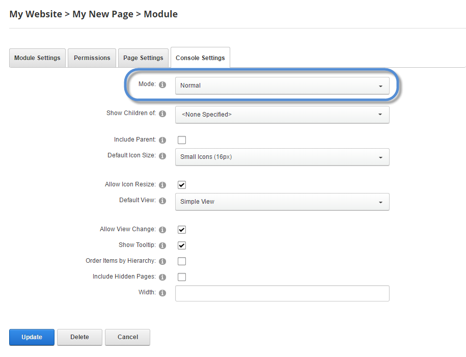
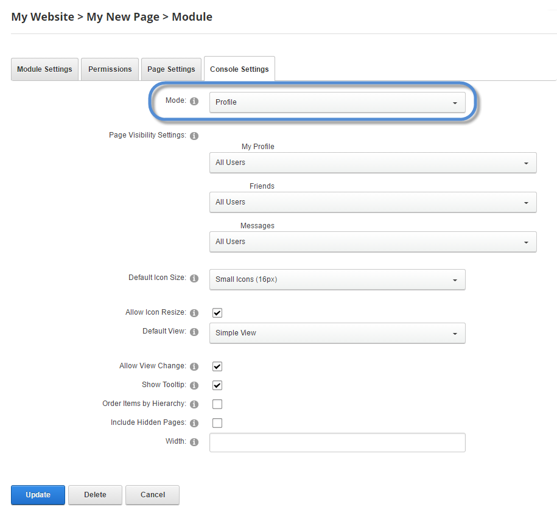
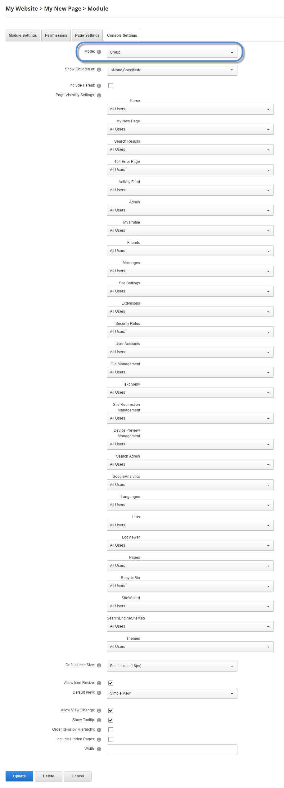

# Configure the Console Module

## Steps

1.  Go to the page containing the module to configure. Edit the page.
2.  In the module's action menu bar, go to Manage (gear icon) \> Settings.
    
      
    
    
    
      
    
3.  Go to the Console Settings tab.
    
    Common settings
    
    Field
    
    Description
    
    Mode
    
    The mode for the current module instance.
    
    *   Normal. If selected, the module displays the child pages of the current page.
    *   Profile. If selected, the module displays the child pages of the current user's profile information.
    *   Group. If selected, the module displays the child pages of the group page.
    
    Default View
    
    The initial configuration of the module's contents.
    
    *   Simple View
    *   Detailed View
    
    Allow View Change
    
    If checked, the user can toggle between the Simple View and the Detailed View.
    
    Show Tooltip
    
    If checked, displays a detailed description when the user hovers over each icon.
    
    Order Items by Hierarchy
    
    If checked, displays the child pages immediately after their respective parent pages. Otherwise, all pages are displayed alphabetically in a flat list.
    
    Include Hidden Pages
    
    If checked, the tree/list includes hidden pages.
    
    Width
    
    The maximum width (in pixels) of the icons to reduce the width of the module. If blank, the icons can expand horizontally based on the window size. Example: You can enter 400 to simulate a grid with two columns of icons.
    
    1.  Mode: Normal
        
          
        
        
        
          
        
        Field
        
        Description
        
        Show Children of
        
        The page whose children to display.
        
        Include Parent
        
        If checked, the parent is also included in the tree/list of its children.
        
    2.  Mode: Profile
        
          
        
        
        
          
        
        Field
        
        Description
        
        Page Visibility Settings
        
        Who can see each specified page.
        
    3.  Mode: Group
        
          
        
        
        
          
        
        Field
        
        Description
        
        Show Children of
        
        The page whose children to display.
        
        Include Parent
        
        If checked, the parent is also included in the tree/list of its children.
        
        Page Visibility Settings
        
        Who can see each specified page.