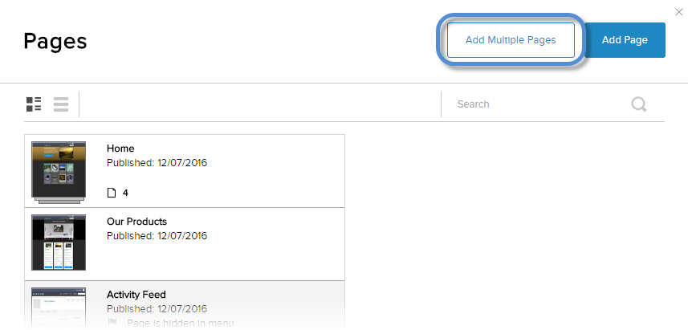
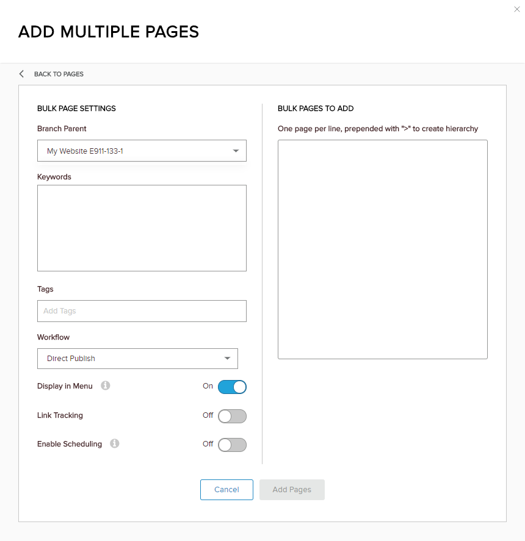
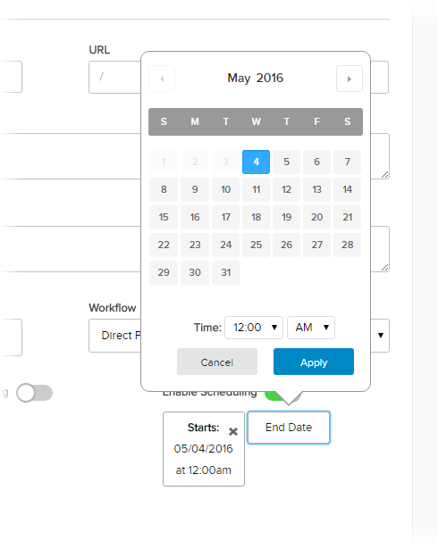

# Create Multiple Page

## Steps

1.  Go to Persona Bar \> Content \> Pages.
    
    
    
    ➊
    
    ➋
    
2.  Click/Tap Add Multiple Pages.
    
      
    
    
    
      
    
3.  Configure the settings that are common among the new pages.
    
      
    
    
    
      
    
    Field
    
    Description
    
    Parent Page
    
    Branch Parent
    
    The page under which the new page(s) should reside in the hierarchy.
    
    Keywords
    
    Comma-separated keywords that can be used by search engines to help index your site's pages.
    
    Tags
    
    Predefined tags that you can choose from the dropdown, if any are defined in the Taxonomy Manager.
    
    Workflow
    
    Predefined workflow states that you can choose from the dropdown.
    
    Display in Menu
    
    If enabled, the page is included in the main navigation menu. If the page is not included in the navigation menu, you can still link to it using its URL.
    
    Link Tracking
    
    If enabled, tracking links are created to determine where traffic to the page is coming from.
    
    Enable Scheduling
    
    If enabled, the Start Date and End Date buttons appear below the switch. Click/Tap on either button to set the time span when the page is publicly visible on the site.
    
    *   The page is published after the specified start date. If Start Date is not set, the page is published immediately.
    *   The page is hidden after the specified end date. If End Date is not set, the page is visible indefinitely.
    
      
    
    
    
      
    
    Bulk Pages to Add
    
    The names of the pages to add for use in the navigation. One per line. To create a hierarchy, prepend the name with `>`. Example:
    
    ```
    
    Topic 1
    >Topic 1.1
    >Topic 1.2
    >>Topic 1.2.1
    Topic 2
                            
    ```
    
4.  Click/Tap Add Pages.

## What to do next

Configure each page individually, according to page type.

*   [Standard](configure-page-standard)
*   [Existing](configure-page-existing)
*   [URL](configure-page-url)
*   [File](configure-page-file)