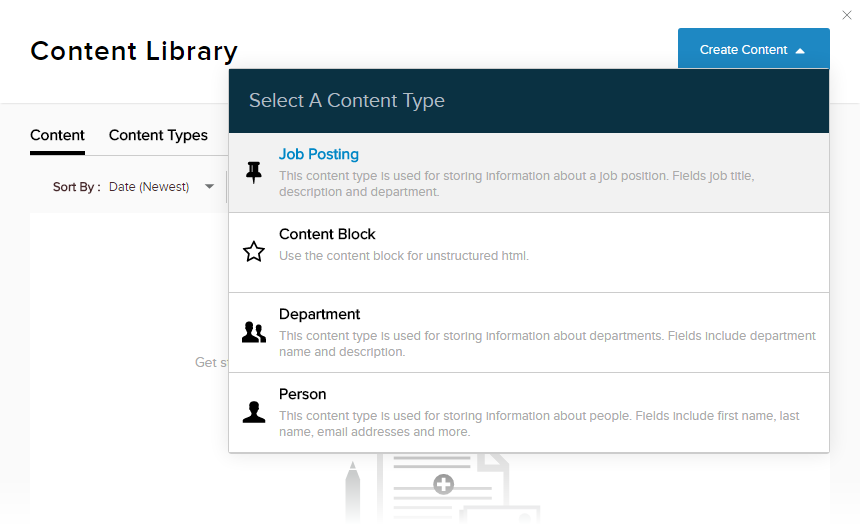
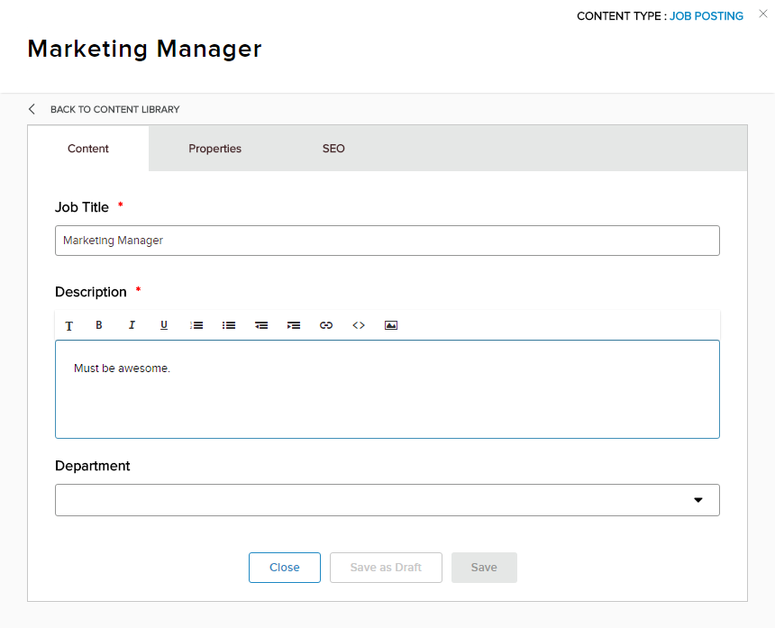
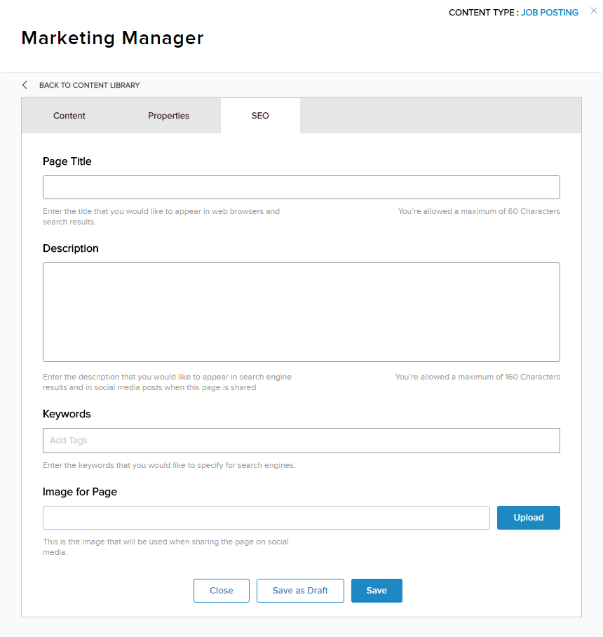

# Create a Content Item

## Prerequisites

*   **Microservices must be enabled for your site.**

## Steps

1.  Go to Persona Bar \> Content \> Content Library.
    
    
    
    ➊
    
    ➋
    
2.  Go to the Content tab.
    
    
    
3.  Click/Tap Create Content, then select the type for this content item.
    
      
    
    
    
      
    
4.  Fill in the fields of the content item.
    
    The fields would depend on the content type you selected. Example: The content type for the content item in this image is Job Posting.  
    
    
    
      
    
5.  In the Properties tab, configure the properties of the content item.
    
      
    
    
    
      
    
    Field
    
    Description
    
    Content Item Name
    
    The name used to refer to the content item.
    
    Tags
    
    A comma-separated list of tags to associate with the content item. You can also press Enter after typing each tag.
    
    Description
    
    A short description of the content item.
    
6.  In the SEO tab, configure the SEO for the content item.
    
      
    
    
    
      
    
    Field
    
    Description
    
    Page Title
    
    The content item title to use in web browsers and search results.
    
    Description
    
    The content item description to use in search engine results and in social media posts when this item is shared.
    
    Keywords
    
    Tags to associate with this content item when search engines perform indexing.
    
    Image for Page
    
    Image to use when the page is shared in social media.
    
7.  Close, save as draft, or save as completed.
    
    Close
    
    Discards changes made in this session.
    
    Save as Draft
    
    Saves changes made in this session, then closes the window. The content item is hidden from the public.
    
    Save
    
    Saves changes made in this session, then closes the window. The content item moves forward to the next step in the workflow.