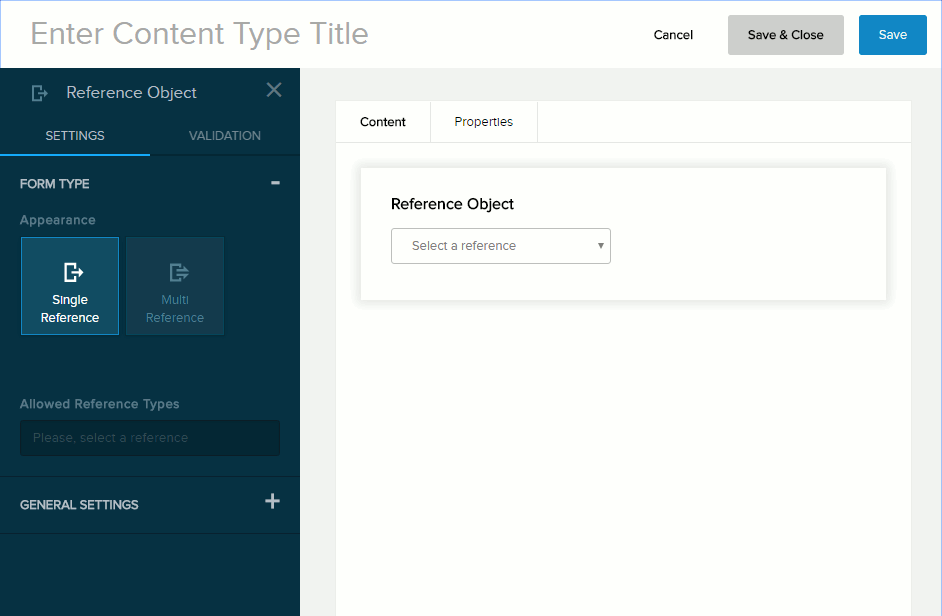
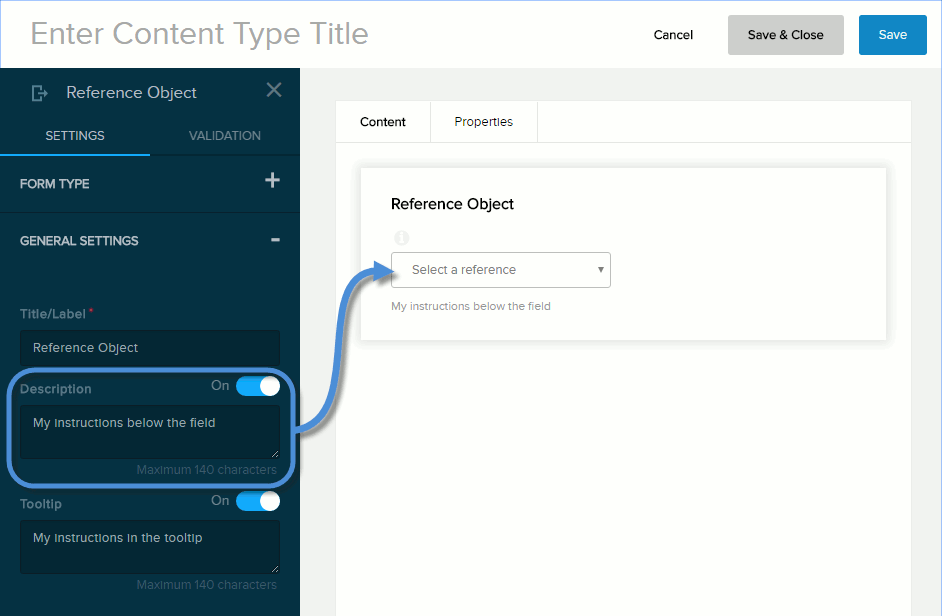
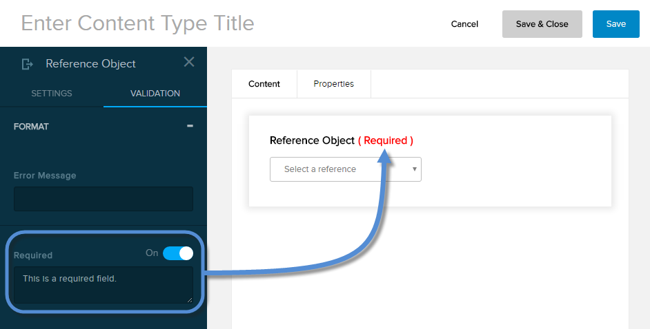

# Content Field: Reference Object

## Form Type

  

  

Field

Description

Appearance

*   Single Reference. Allows the user to link to only one content item.
*   Multi Reference. Allows the user to link to multiple content items.

Allowed Reference Types

The list of content types that the reference can point to.

## General Settings

  

  

Field

Description

Title/Label

Name of the field. You can change the name either in the General Settings panel or directly above the field on the canvas.

Description

If enabled (On), displays the instructions or field description you enter in the provided text box. Maximum length: 140 characters.

Tooltip

If enabled (On) and the user hovers/clicks/taps over the information icon (i) next to the field name, displays the help text you enter in the provided text box. Maximum length: 140 characters.

## Validation

  

  

Field

Description

Error Message

The message to display if the user entered data that does not meet the requirements for the field.

Required

If enabled (On),

*   The field name is marked as required.
*   The message you enter in the provided text box will be displayed if the user does not provide a value in the field.

Number of References

If enabled (On), the message you enter in the provided text box will be displayed if the user provides a value outside the valid range. You must indicate the valid range:

*   Minimum. The valid range is from the value you enter in Min to infinity.
*   Maximum. The valid range is from infinity to the value you enter in Max.
*   Between. The valid range is from the value you enter in Min to the value you enter in Max.

Min must be less than Max.