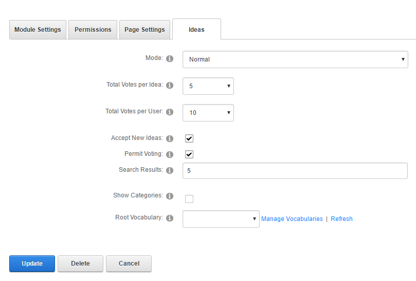

# Configure the Ideas Module

## Steps

1.  Go to the page containing the module to configure. Edit the page.
2.  In the module's action menu bar, go to Manage (gear icon) \> Settings.
    
      
    
    
    
      
    
3.  Go to the Ideas tab.
    
      
    
    
    
      
    
    Field
    
    Description
    
    Mode
    
    The mode for the current module instance.
    
    *   Normal. If selected, the contents of the module are available to all registered users of the site.
    *   Group. If selected, the contents of the module are restricted to group members.
    
    Total Votes per Idea
    
    The maximum number of votes that a user can give to a single idea. The votes can be given at different times, but the cumulative number cannot exceed this value.
    
    Total Votes per User
    
    The total number of votes that a single user can distribute among any number of ideas within the current module. While voting is enabled, votes can be changed, and revoked votes return to the user's voting pool.
    
    Accept New Ideas
    
    If checked, registered users can submit their own ideas. If you are performing a survey, uncheck this option.
    
    Permit Voting
    
    If checked, voting is allowed. You can allow users to preview ideas before voting by keeping this box unchecked, then you can check this box when voting begins. To end the voting period, uncheck this box again.
    
    Search Results
    
    The number of items to display in each result page.
    
    Show Categories
    
    If checked, users adding new ideas would be required to choose a category from the selected vocabulary.
    
    Root Vocabulary
    
    A node in a vocabulary tree to use as the root node. The vocabulary must already be defined in the site's taxonomy. The Manage Vocabularies link takes you to the Taxonomy Manager so you can create or update vocabularies. The Refresh link updates the Root Vocabulary dropdown box.